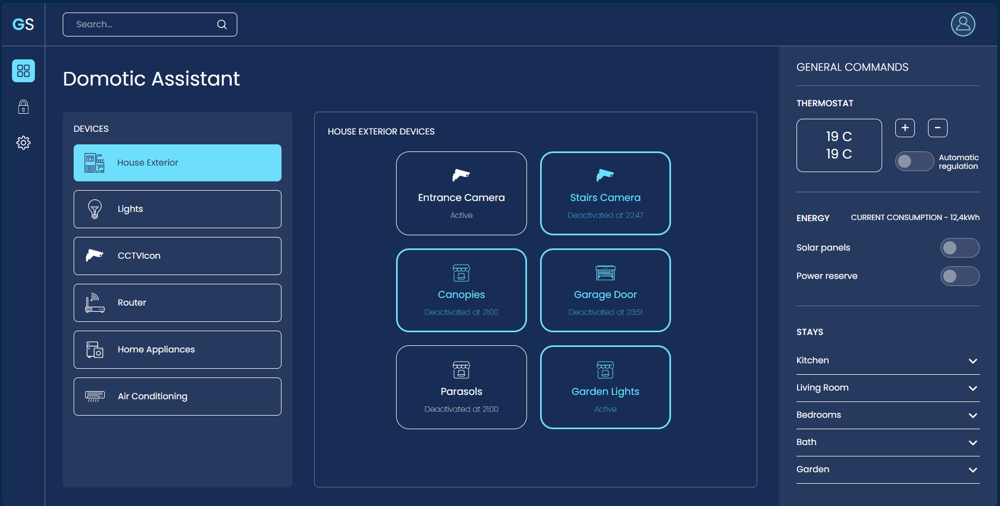
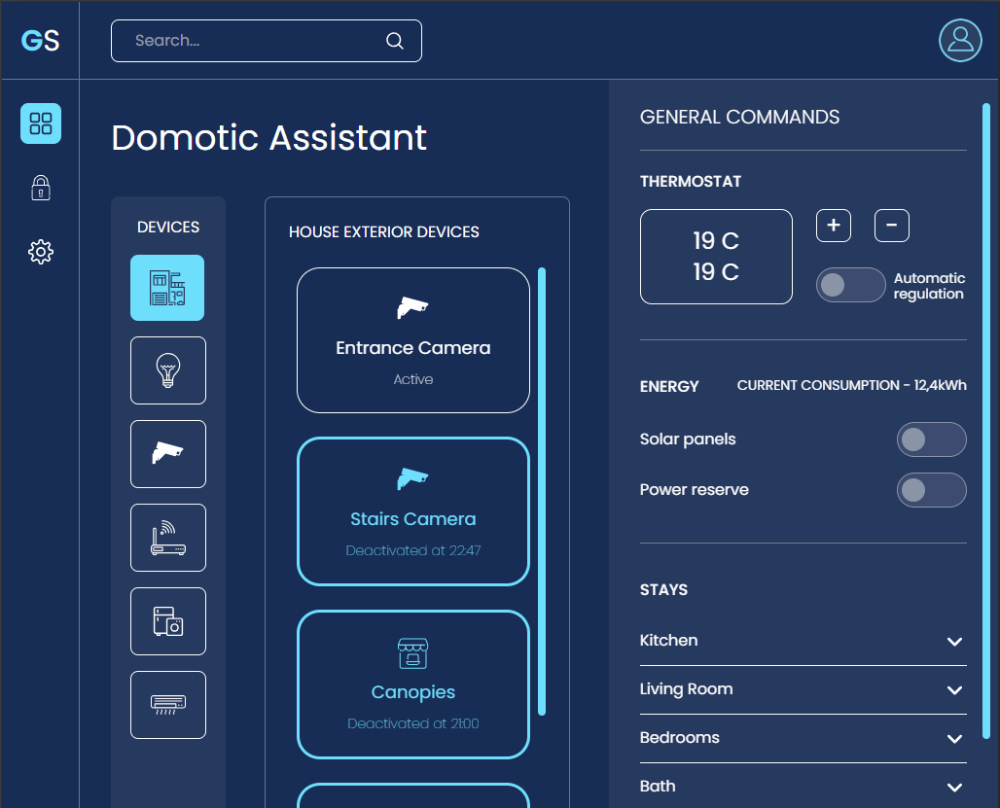

# Take Home Assignment

A full-stack application demonstrating authentication, protected routes, and modern React UI components built with `Express.js` backend and `React + TypeScript` frontend.

### Desktop View:

### Tablet View:

### Mobile View:


## Project Structure
Only the `src` file structure is shown below.
```
├── backend/
│   ├── src/
│   │   ├── db/
│   │   │   └── dbFunctions.js
│   │   ├── routes/
│   │   │   ├── login.js           # Authentication routes for login
│   │   │   └── account.js         # Account routes with middleware
│   │   ├── utils/
│   │   │   └── index.js           # JWT middleware
│   │   └── server.js
│   └── package.json
├── frontend/
│   ├── src/
│   │   ├── @common/                # Utility functions and types
│   │   │   ├── types.ts            # Global TypeScript interfaces
│   │   ├── @routes/
│   │   │   ├── api.ts              # API endpoints and methods
│   │   ├── assets/                 # Images and icons(SVG)
│   │   ├── components/             # Reusable UI components
│   │   │   ├── elements/           # Atomic components
│   │   │   │   ├── dashboard/
│   │   │   │   │   ├── deviceTile.tsx
│   │   │   │   │   ├── subDeviceTile.tsx
│   │   │   │   │   └── general_commands/
│   │   │   │   │       ├── energy.tsx
│   │   │   │   │       ├── stays.tsx
│   │   │   │   │       └── thermostat.tsx
│   │   │   │   ├── inputSearch.tsx
│   │   │   │   ├── toggleButton.tsx
│   │   │   │   ├── expandableInfoTile.tsx
│   │   │   │   ├── sideNavbarButton.tsx
│   │   │   ├── widgets/            # Compound components
│   │   │   │   ├── dashboard/
│   │   │   │   │   └── generalCommands.tsx
│   │   │   │   ├── header.tsx
│   │   │   │   ├── sideNavbar.tsx
│   │   ├── interfaces/             # Page-level components
│   │   │   ├── dashboard.tsx
│   │   ├── layouts/                # Layout components
│   │   │   ├── main/
│   │   │   │   └── index.tsx
│   │   │   ├── dashboard/
│   │   │   │   └── index.tsx
│   │   ├── models/                 # Data models and classes
│   │   │   ├── userModel.ts
│   │   ├── pages/                  # Pages
│   │   │   ├── login.tsx
│   │   ├── App.tsx
│   │   ├── App.css                 # App-specific styles
│   │   ├── main.tsx
│   │   └── index.css               # Global styles with CSS variables
└── README.md
```
# Completed TODO

 - ## Frontend Task
   
   ### Requirements
   
   -   Recreate the UI shown in the provided image ✅
   -   Start with the base template provided tailwind is setup ✅
   
   ### Evaluation Criteria
   
   -   Code organization and structure ✅
   -   Component reusability ✅
   -   State management implementation ✅
   -   UI/UX accuracy ✅
   -   Responsive design implementation ✅
   -   Code documentation ✅
   
   ## Backend Task
   
   ### Requirements
   
   1.  **Authentication System**
       -   Create a login route that returns a JWT authentication token ✅
       -   Implement proper password hashing ✅
       -   Include input validation ✅
       -   Return appropriate error messages ✅
   2.  **JWT Middleware**
       -   Create a middleware function to verify JWT authentication tokens ✅
       -   Handle token expiration ✅
       -   Implement proper error handling ✅
       -   Secure routes using the middleware ✅
   3.  **Protected Account Route**
       -   Create an account route that can only be accessed using a valid JWT token ✅
       -   Implement proper error handling ✅
       -   Return appropriate user data ✅

## How To Get Startup

### Backend Setup

1.  Navigate to the backend directory:
    
    ```bash
    cd backend
    ```
2.  Install dependencies:

    ```bash
    npm install
    ```
3.  Create a `.env` file (optional):

    ```env
    PORT=5000
    SECRET=your-jwt-secret-key
    ```
4.  Start the development server:

    ```bash
    npm run dev
    ```
The backend will run on `http://localhost:5000`

### Frontend Setup

1.  Navigate to the frontend directory:
 
    ```bash
    cd frontend
    ```
2.  Install dependencies:

    ```bash
    npm install
    ```
3.  Start the development server:

    ```bash
    npm run dev
    ```
The frontend will run on `http://localhost:5768`

## Authentication

### Test Credentials

-   **Email**: `test@example.com`
-   **Password**: `hashedPassword123`

## UI Components

### Reusable Components
I used atomic components structure for this project
-   **DeviceTile**: Interactive device selection tiles
-   **SubDeviceTile**: Multi-select sub-device controls
-   **ToggleButton**: Custom toggle switches
-   **InputSearch**: Search element input with icon
-   **ExpandableInfoTile**: Collapsible content tiles for `General Commands asid setting`

*Example of Use:*
```
├── components/             # Reusable UI components
│   ├── elements/
│   │   ├── dashboard/
│   │   │   ├── deviceTile.tsx
│   │   │   ├── subDeviceTile.tsx
│   │   │   └── general_commands/
│   │   │       ├── energy.tsx
│   │   │       ├── stays.tsx
│   │   │       └── thermostat.tsx
│   │   ├── inputSearch.tsx
│   │   ├── toggleButton.tsx
│   │   ├── expandableInfoTile.tsx
│   │   ├── sideNavbarButton.tsx
```

### Layout System

-   **Main Layout**: Header + Sidebar + Content area
-   **Dashboard Layout**: Grid-based responsive layout
-   **CSS Grid**: Modern layout implementation (Grid Template Areas)

## API Endpoints

### Authentication

-   `POST /api/login` - User login with email/password
-   `GET /api/account` - Get user account details (protected)

### Request/Response Examples

#### Login Request
```json
{
  "email": "test@example.com",
  "password": "hashedPassword123"
}
```

#### Login Response

```json
{
  "message": "Login successful",
  "error": false,
  "token": "eyJhbGciOiJIUzI1NiIsInR5cCI6IkpXVCJ9..."
}
```

#### Account Request

```bash
Headers: {
  "auth-token": "eyJhbGciOiJIUzI1NiIsInR5cCI6IkpXVCJ9..."
}
```